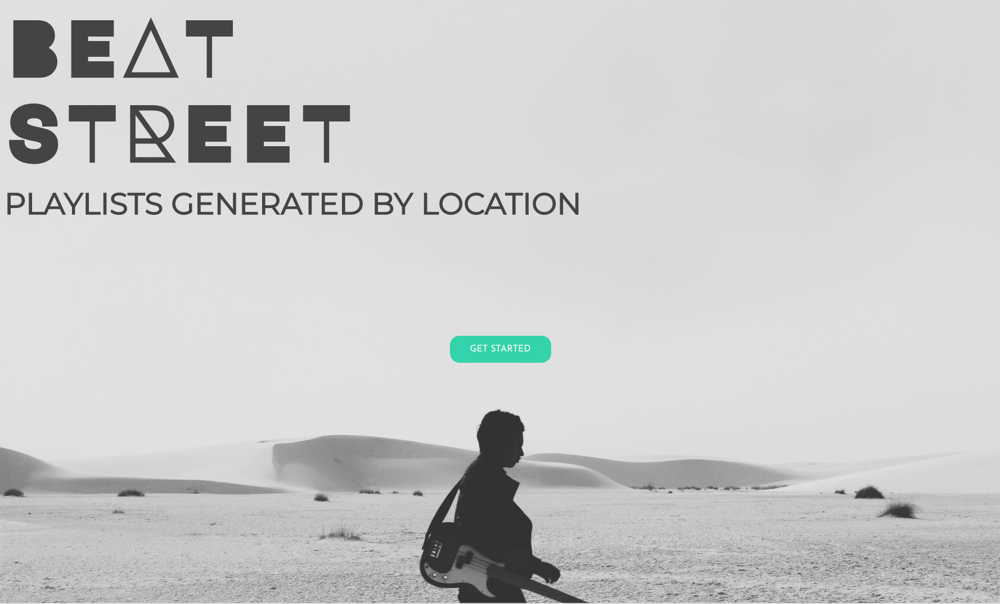

    

         <h1 class="margin-0">Landing Page</h1>
    

    

        
    

    

         <h1 class="margin-0">Location Choice</h1>
    

    

        
    

    

         <h1 class="margin-0">Animated Loading</h1>
    

    

        
    

    

         <h1 class="margin-0">Playlist Creation</h1>
    

    

        
    

