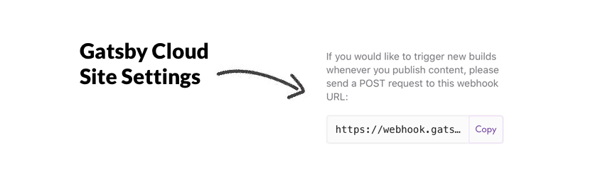

I took the plunge and moved my blog to medium. I wanted a better writing experience. Writing in Markdown was leading to too many spelling mistakes and, with me writing more and more, my repo was getting bigger with each post!

Medium exposes an rss feed for your posts that you can find at:

https://medium.com/feed/@yourUsername

Using this and the [gatsby-source-rss-feed](https://www.gatsbyjs.org/packages/gatsby-source-rss-feed/?=source%20rss) plugin meant that there was very little front end change to switching the blog over. Using the plugin exposes the title, date and story content of each post. The only thing I lost in the move was an auto generated excerpt of each article that gatsby-transformer-remark had made for me. I had been using it for meta-descriptions for SEO so really wanted it back. I fixed this by updating my gatsby-node to create a field called excerpt whenever it made an article node:
```
createNodeField({  
      node,  
      name: "excerpt",  
      value:  
        node.content.encoded.replace(/<[^>]*>?/gm, "").substring(0, 150) +  
        "...",  
})
```
The regex you’re seeing above strips the html from the content so you are left with plain text. I then take the first 150 characters (Google like ~150 characters for site indexing) and append “…”. This creates descriptions that look like this:

When you’re browsing BBC news, or streaming your favourite Youtube videos, I doubt you’re thinking about the site’s accessibility. We all frequent the...

<figure>
  
  <figcaption>How it looks in the wild.</figcaption>
</figure>

🎉 Just enough to pull you in, and perfect for a preview.

### Triggering Builds 🔨

The query for the RSS feed data only occurs when I build the site. But, I don’t want to have to trigger a build manually every time.

I am currently using the [Gatsby Cloud](https://www.gatsbyjs.com/) to build and deploy my site. It is by far the fastest way to build a Gatsby site that I have come across. This is expected given that it has been set up with the purpose of building Gatsby projects. New builds are currently triggered whenever I commit new code to the master branch and take around 90 seconds. But how do we deploy automatically when I post to Medium? Two words — Web-hooks 😍.

When you create a a new project in the Gatsby cloud, they expose a web-hook that you can post to to trigger builds:



🤔 But I still didn’t have a mechanism to trigger it automatically.

### Enter IFTTT ❤️

By pure chance, I was browsing [IFTTT](https://ifttt.com/) that same day looking for applets I could use for my home automation, when I saw that Medium had an [integration](https://ifttt.com/medium). I was able to create an applet — “If Post published by you, then Make a web request”. I simply pointed the web request to the Gatsby web-hook and it was good to go.


<figure>
  
  <figcaption>The holy trinity.</figcaption>
</figure>

### The Result 🏁

When I post to medium, within 10 seconds the hook is triggered, my personal site is built and deployed:


The average time for this process is 105 seconds. That’s quick 🏃‍♂️.
