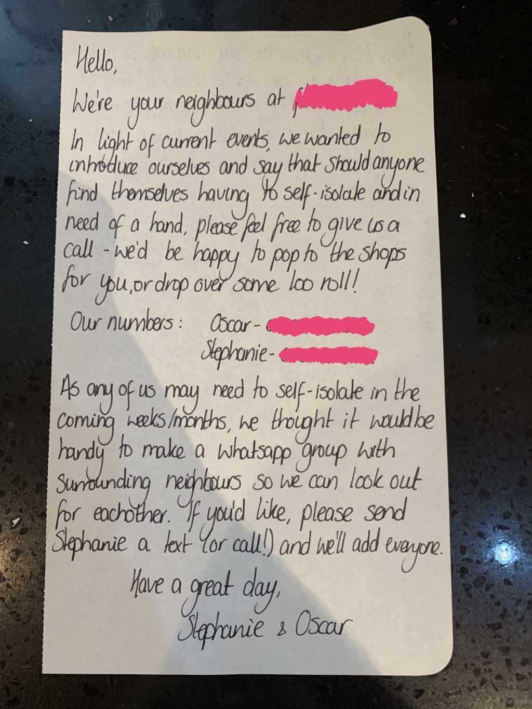
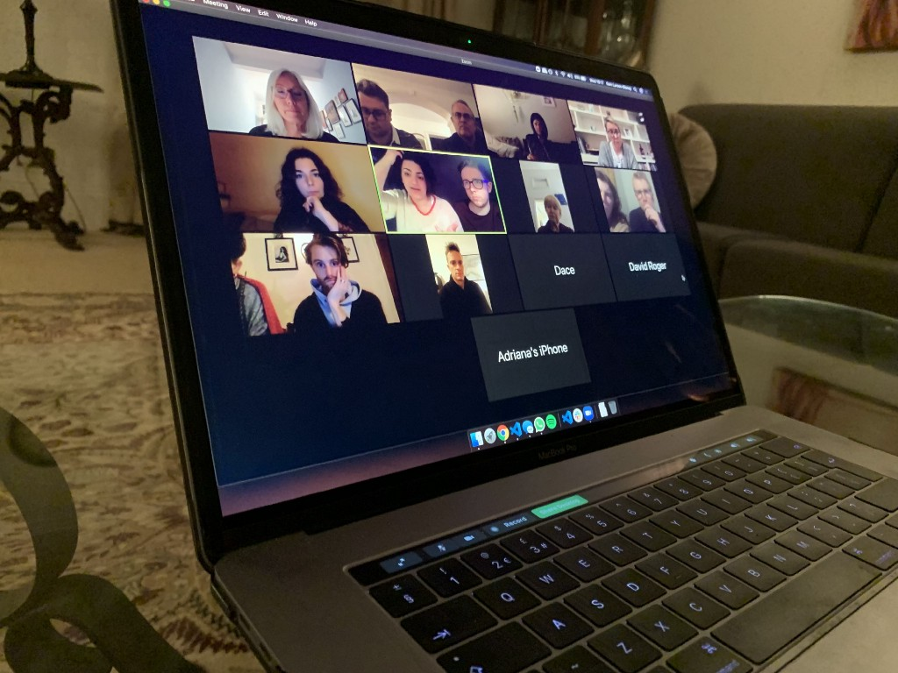
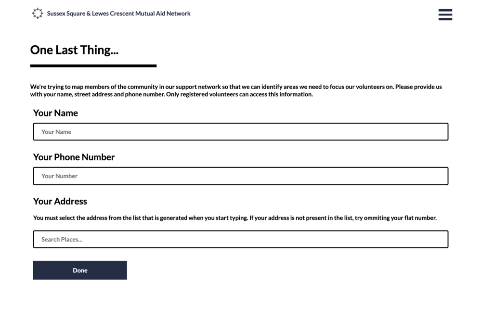
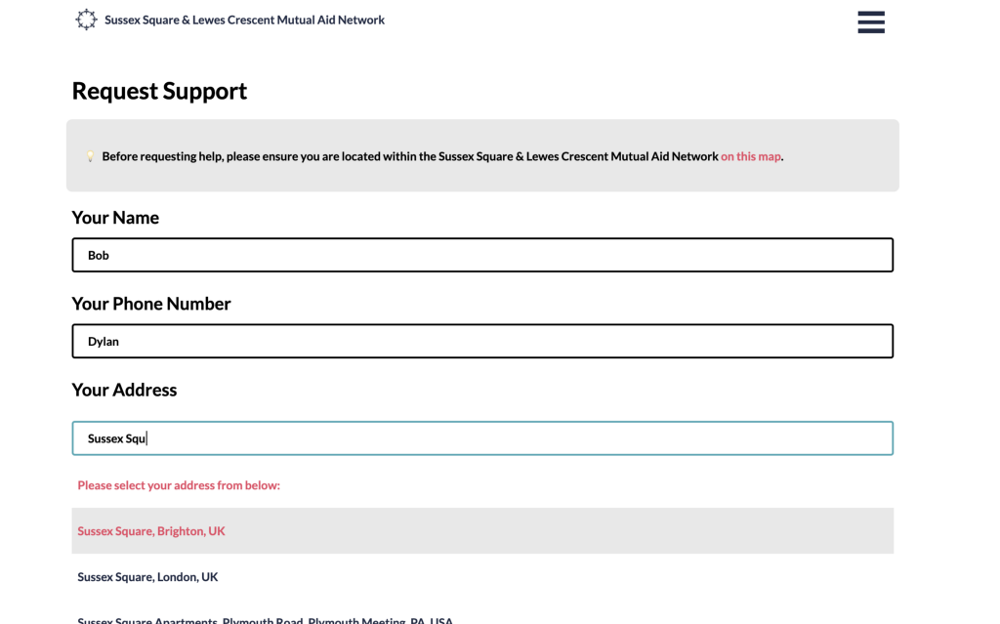

A couple of weeks back, I came home to find this note taped to my front door..

<figure>
  
  <figcaption>The Letter.</figcaption>
</figure>

My neighbours, had taken the initiative to set up a WhatsApp group of local people that would get us all talking and so we could look out for each other while in isolation. I thought this was an awesome idea and joined the group to see what I could do.

I wasn’t the only one, after 24 hours, the WhatsApp group had 50+ members and rising. During this time people were introducing themselves, often stating whether they were able to help or might be someone needing more support during this difficult time. Seeing the amount of messages being sent, I was thinking it might be a little too easy to lose track of those we might need to look out for.

With the scale of the group what it was, Kelly(the group admin) set up a zoom call to get us all acquainted and work out what we could realistically offer.

<figure>
  
  <figcaption>The zoom call 🤙</figcaption>
</figure>


We defined our scope of help as...

*We are volunteering to help each other as a community. As such, of course this is completely free. We are offering help with errands such as picking up urgent supplies, shopping, posting mail, dog walking or just friendly phone call.*

#### The Problem

It assumed that the method that people would use to request help was the WhatsApp group. From an administrative stand point, keeping track of requests for help that are being lost in swarms of messages sounded a little insane. How would we know they had been handled? and by who? It was at this point, I jumped into the call and said:

> Let me build a site where people can submit requests for help and volunteers can claim them. That way we won’t lose any.

It was agreed that it was a cool idea so I set to work.

#### My Approach

I’m normally a bit of a perfectionist but, this time, speed was most important. I needed to get a version live as soon as possible. I gave myself one day to get the first version live and five days to complete the project. In order to maximise the time I spent building what mattered, I stole plenty of code from my previous projects:

*   The site was built using [one of my GatsbyJS boilerplates](https://sld.codes/boilerplates).
*   Styles were taken from my [personal site](https://sld.codes/).
*   Animated loading spinners were stolen from a [hackathon project](https://sld.codes/projects/beat-street).

As the solo developer on this project, I didn’t even want to have to worry about content. I set the other volunteers the task of writing the text for the landing page and creating the logo. This left me totally free to worry about the functionality of the site.

#### Minimum Viable Product

In order to have version one available, I needed the following features...

*   A way for those in need to create requests.
*   A way for authorised volunteers to claim these requests and mark them as resolved.

Two pieces of different functionality for two different user types.

#### Firebase

I needed a back-end but I’m not a back-end dev and wouldn’t know where to start. Luckily, I was able to get firebase to do most of the heavy lifting for me. I made use of firebase’s authentication and realtime-database.

By using a realtime database, I could watch the DB for changes and immediately update the UI to show this change. This is great for when vulnerable people submit requests for help.

#### Authentication Hook

Given that most of the people using the site would not be ‘spring chickens’, I decided to leave most of the social login options off. I kept it simple, login with an email/password combination or your google account.

In order to use the auth in the context of my Gatsby site, I created a react hook called useAuth...
```js
export const useAuth = () => {  
  const [state, setState] = React.useState(() => {  
    const user =  
      typeof window !== "undefined" ? firebase.auth().currentUser : "";  
    return { initialising: !user, user };  
  });  
  function onChange(user) {  
    setState({ initialising: false, user });  
  }  
  React.useEffect(() => {  
    const unsubscribe = firebase.auth().onAuthStateChanged(onChange);  
    return () => unsubscribe();  
  }, []);  
  return state;  
};
```
You’ll notice a weird ternary above checking the type of window. This is because firebase’s web implementation will not work server side and therefore would break my build without this check. Using the hook above, I could listen for auth changes, and ensure that the user info had loaded before rending any user related content. For example:
```js
const App = () => {  
  const { initialising, user } = useAuth();  
  if (initialising) {  
    return /* Content to show while loading */;  
  } else {  
    return; /* Content to show when we have the user profile. At this point if user is undefined we know the user is not logged in. */  
  }  
};  
export default App;
```
#### User Type

I used a series of routes to handle users that have logged in. I would first retrieve their user profile from the DB. I would then perform a series of checks to ensure they had a role and profile information before showing them their content:
```text
If user does not have a type
 -> Prompt user to choose "volunteer" or "need support"  
If user does not have an address, name and phone number 
 -> Prompt user to add this information  
Otherwise
 -> Show the user the correct content for that type of account
```

<figure>
  
  <figcaption>Prompting for additional info.</figcaption>
</figure>

```
If user does not have an address, name and phone number  
-> Prompt user to add this information
```
#### Calculating the Position of Requests

I wanted to acquire the latitude and longitude of requests so I could plot them on a map for volunteers. To do this I found an awesome little npm package — “[react-places-autocomplete](https://www.npmjs.com/package/react-places-autocomplete)”. That plus a [google maps API](https://googleapis.dev/) key and I was good to go:
```js
import { geocodeByAddress, getLatLng } from "react-places-autocomplete";  
const handleAddressSelect = (address) => {  
  geocodeByAddress(address)  
    .then((results) => getLatLng(results[0])) //closest result  
    .then((latLng) => {  
      setData({  
        ...data,  
        address,  
        latLng,  
      });  
    })  
    .catch((error) => console.error("Error", error));  
};
```
In the above code, we take a string address and getLatLng utilises the google maps API to turn it into coordinates. This was triggered when a user selected an address from the list:

<figure>
  
  <figcaption>Requesting support</figcaption>
</figure>

Upon submission of a request, this data was bundled up and sent to the firebase realtime database. It also triggered text alerts to volunteers encouraging them to check the site and retrieve the request.
