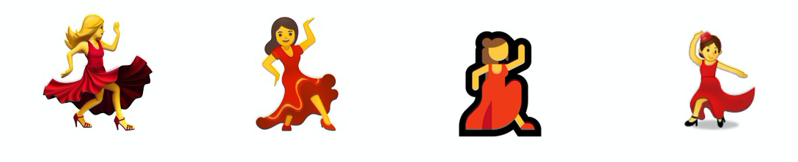

I've spent more time than I care to admit working on my personal website while in lockdown. I've added many useful features like a site search and a stats page but I've also tried to add some fun features too. Today I want to talk about one such feature, the reactions available on my articles.

I was browsing the web searching for `useCallback` implementations when I found an article on [dev.to](https://dev.to/). One thing I really like about their article pages is the reactions that sit on the left hand side of the main content. As opposed to a "standard thumbs up reaction", they have opted for a heart and unicorn. As I scroll through the article, the reactions remain sticky and remain on the screen - constantly encouraging interaction with the content. I thought I would attempt to implement a similar component on my personal site. 

### Emojis and Native Support

In total there are 3,304 emojis in the Unicode Standard, as of March 2020. The most recent emoji release is [Emoji 13.0](https://emojipedia.org/emoji-13.0/), which added 117 new emojis. Some operating systems support the most modern standard while others lag behind. This means that when using unicode emojis you may find that its appearance varies. 



While this is totally fine when texting, you probably are looking for a more consistent experience on your website. The solution I decided to use was [`react-emoji-render`](https://www.npmjs.com/package/react-emoji-render). In its default use case it will normalise all of the different emoji notations to native unicode characters but you can also tell it to use a particular emoji set like [Twemoji](https://github.com/twitter/twemoji) which is what I opted for.  Same emojis everywhere!

```jsx
let myEmojiChoice = [
  { type: "fire", label: "🔥" }, // "It's hot!"
  { type: "popcorn", label: "🍿" }, // "It's entertaining."
  { type: "unicorn", label: "🦄" }, // "It's magical."
  { type: "avo", label: "🥑" }, // "I'm a millennial."
]
```

### Come scroll with me

It was super important that, on screen sizes that were wide enough, the option to react to the article remained on the screen. In order to achieve that I needed to keep track of the y-scroll position, luckily theres a really cool custom hook I found on npm called [`react-use-scroll-position`](https://www.npmjs.com/package/react-use-scroll-position) which has a helper function that keeps track of that:

```jsx
const scrollY = useScrollYPosition();
```

With this I can then set the position of the element using an in-line style tag:

```jsx
<div
	style={{
		position: "fixed",
		top: scrollY ? Math.max(20, 335 - scrollY) : 335
	}}
>
	{Reactions}
</div>
```

By using `Math.max()` we can ensure that the element starts at the correct place on the side, 335 px down from the top, and only starts following when it is 20px from the top of the window. Cool? Cool.

### Keeping track of your reactions
#### Client-side

Much like a facebook post, I wanted you to be able to react once by clicking the emoji and by clicking it again remove your reaction. If you're interested in mashing buttons you [should read this article](/articles/Creating-onMash-for-the-Click-Addicts). I also wanted to ensure that if you left the site and came back your reactions would be remembered. I decided to use `window.localstorage` to do this, all wrapped up in a custom hook:

```jsx
export function useLocalStorage(key, initialValue) {
  const [storedValue, setStoredValue] = useState(() => {
    try {
      const item =
        typeof window !== "undefined"
          ? window.localStorage.getItem(key)
          : undefined
      return item ? JSON.parse(item) : initialValue
    } catch (error) {
      console.log(error)
      return initialValue
    }
  })
  const setValue = (value) => {
    try {
      const valueToStore =
        value instanceof Function ? value(storedValue) : value
      setStoredValue(valueToStore)
      typeof window !== "undefined" &&
        window.localStorage.setItem(key, JSON.stringify(valueToStore))
    } catch (error) {
      console.log(error)
    }
  }

  return [storedValue, setValue]
}
```

When navigating to an article I instatiate this hook:

```jsx
const [likes, setLikes] = useLocalStorage("likes", {})
```

Then when incrementing likes, I can check if there are any existing likes for this content and if not then set the reactions of that type to 1. 

```jsx
const incrementLikes = (type) => {
    let contentLikes = likes && likes[contentID] ? likes[contentID] : {}
    if (!contentLikes[type] || contentLikes[type] < 1) {
      setLikes({ ...likes, [contentID]: { [type]: 1 } })
    }
  }
```

A similar approach was taken for decrementing likes.

#### Global

I use a [firebase firestore](https://firebase.google.com/docs/firestore) to keep track of the reactions made by all users. I wont go into detail about setting up a gatsby project to use firebase here but [`gatsby-plugin-firebase`](https://www.gatsbyjs.org/packages/gatsby-plugin-firebase/) is a great place to start. There's also a [great article by Kyle Shelvin](https://kyleshevlin.com/firebase-and-gatsby-together-at-last) that has a very solid introduction to using it. I use that in combination with [`react-firebase-hooks`](https://www.npmjs.com/package/react-firebase-hooks) to read from the database. I do just want to note that I use the hook "useDocumentOnce" as opposed to "useDocument". This means that it reads the data once when loading the page, instead of continually reading. This reduced the amount of usage my database saw from thousands reads to hundreds of reads and therefore saves me money. The only downside is that the reactions may be out of sync if they are liked by someone else while you are still viewing the page. 

Using this implementation I can retrieve reactions for a given article with the following code:

```jsx
const [value, loading, error] = useDocumentOnce(firebase.firestore().doc(`likes/${contentID}`))
```

I can use this data to populate the number of reactions of a type under the corresponding emoji. And I can update my `incrementLikes` function accordingly:

```jsx
const incrementLikes = (type) => {
    let contentLikes = likes && likes[contentID] ? likes[contentID] : {}
    // If the firebase store has loaded, there is no error and you have not already reacted.
    if (!loading && !error && (!contentLikes[type] || contentLikes[type] < 1)) {
      setLikes({ ...likes, [contentID]: { ...contentLikes, [type]: 1 } })
      // combine the values retrieved from firebase with your additional reaction.
      setNormalisedValues({
        ...normalisedValues,
        [type]: normalisedValues[type] + 1,
      })
      // ping the firebase store to increment the reactions for the contentID
      firebase
        .firestore()
        .collection("likes")
        .doc(contentID)
        .set(
          {
            [type]:
              value.data() && value.data()[type] ? value.data()[type] + 1 : 1,
          },
        	// ensure data is merged so that other reaction types are not overridden 
          { merge: true }
        )
    }
  }
```

### Thats all Folks! 

I hope you enjoyed this little insight into how the reactions work, why don't you try one of them out now? Better yet, if you like my content subscribe to my newsletter and I will let you know when I post something new! Always no ads or sponsors.

