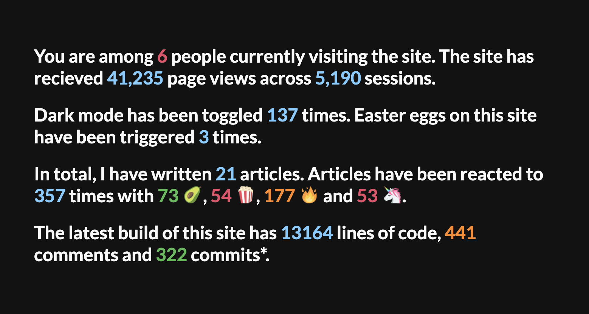
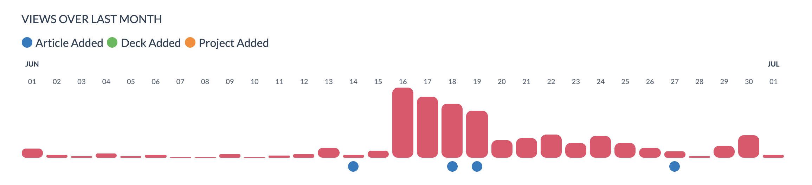

import AnchorLink from "react-anchor-link-smooth-scroll";
import { Link } from "gatsby";


> This is my first attempt at a deep dive. Its longer than most of my posts and features rather a lot of code examples. Hope that's cool.

Did you know that the UK government website has a secret stats page for each of its site pages? If you put `/info` before a route, it will show you the stats page for any given page. As an example, if we wanted to look at the stats for the government's page on universal credit, we could type [`https://www.gov.uk/info/universal-credit`](https://www.gov.uk/info/universal-credit).

I have always admired the UX of these stats pages. They seem to convey a large amount of data without it being overwhelming to the user. This is what I wanted for [my stats page](/stats) and was the source of much inspiration when building it.

### You Can't Have Stats Without Data

My site collects data in a variety of different ways, I have site tracking, a database, code statistics, real-time connections and data from external sources. But we can't pull from them without setting them up so they can collect data first.

#### Site Tracking

My site has been live for 9 months now. I've only had tracking set up for 6 months of that but I wish I had done it sooner. Not only do you get page views, but with tools like [google analytics](https://analytics.google.com/), you can get behaviour flows which give you a massive insight into how people are navigating your website.

It should be noted that there are plenty of alternatives to google analytics. As the tool I use, some of this article is geared towards it.

##### Adding Google Analytics

Like everything I seem to want to add to my site - "there's a plugin for that". I added [`gatsby-plugin-google-analytics`](https://www.gatsbyjs.org/packages/gatsby-plugin-google-analytics/) by following these steps:

1. Sign up to Google Analytics and acquire a tracking ID.

2. Install the plugin:

   ```shell
   npm install --save gatsby-plugin-google-analytics
   ```

3. Add it to your Gatsby config:

   ```js
   module.exports = {
     plugins: [
       {
         resolve: `gatsby-plugin-google-analytics`,
         options: {
           trackingId: "Your-Tracking-ID",
         },
       },
     ],
   };
   ```

4. Replace any `<a>` tags with `<OutboundLink>` components:

   ```jsx
   import { OutboundLink } from "gatsby-plugin-google-analytics";

   export default () => (
     <OutboundLink href="https://sld.codes/"> MY LINK </OutboundLink>
   );
   ```

   This allows you to track any links that lead away from your site so you can see where your visitors are going.

The plugin is disabled in development, this ensures that you don't accidentally track yourself while working away on your site. But if you want to test it out you can always `gatsby build && gatsby serve`.

#### Database

I use a database to track how many reactions each of my article have recieved. In fact, I have a whole article on [how I added page reactions](/articles/Creating-Page-Reactions) that you can read if you like.

##### Adding Firebase to your site

I wont go into detail about setting up a gatsby project to use firebase here as I think the topic is well documented. I great place to start is [`gatsby-plugin-firebase`](https://www.gatsbyjs.org/packages/gatsby-plugin-firebase/). There's also a [great article by Kyle Shelvin](https://kyleshevlin.com/firebase-and-gatsby-together-at-last) that has a very solid introduction to using it. I used that in combination with [`react-firebase-hooks`](https://www.npmjs.com/package/react-firebase-hooks) to read from the database.

#### Real-time Connections

I use these connections to [present without sharing my screen](/articles/Presenting-Without-Sharing-My-Screen) but It also works as a great way to retrieve the active number of users on the site. Socket.IO is my go to solution for this kind of thing.

##### Implementing Socket.IO

To use sockets in the project we need to create a server to communicate between connected clients. You can get started quickly by throwing the following on a node server:

```js
const express = require("express");
const PORT = process.env.PORT || 3000;
const server = express().listen(PORT, () =>
  console.log(`Listening on ${PORT}`)
);
const io = require("socket.io")(server);
io.on("connection", function (socket) {
  console.log("socket connected: " + socket.id);
  // On socket connection, emit the new count to everyone.
  io.emit("action", {
    type: "userCount",
    data: io.engine.clientsCount,
  });
  // On socket disconnect, emit the new count to everyone.
  socket.on("disconnect", function () {
    io.emit("action", {
      type: "userCount",
      data: io.engine.clientsCount,
    });
  });
});
```

This also is a great place to throw the cron job I mention below for daily rebuilds.

Now we have a server set we need a way for our clients to recieve the broadcasts. I am a big fan of [this awesome repo](https://github.com/itaylor/redux-socket.io) on Redux and Socket.IO combined. It needs virtually no modification to work within a gatsby project. Lets implement redux on our site:

`gatsby-browser.js`

```jsx
import wrapWithProvider from "./src/state/wrapWithProvider";
export const wrapRootElement = wrapWithProvider;
```

This wrapper needs to wrap our site content in a Redux provider.

`src/state/wrapWithProvider.js`

```jsx
import React from "react";
import { Provider } from "react-redux";
import createStore from "./createStore";
export default ({ element }) => {
  return <Provider store={createStore}>{element}</Provider>;
};
```

In our store we add methods to handle any incoming actions from the server.

`src/state/createStore.js`

```jsx
import { createStore, applyMiddleware } from "redux";
import createSocketIoMiddleware from "redux-socket.io";
import io from "socket.io-client";
let socket = io("http://your-socket-server-here.com");
let socketIoMiddleware = createSocketIoMiddleware(socket, "server/");
function reducer(
  state = {
    count: 0,
  },
  action
) {
  switch (action.type) {
    case "userCount":
      return Object.assign({}, { ...state, count: action.data });
    default:
      return state;
  }
}
let store = applyMiddleware(socketIoMiddleware)(createStore)(reducer);
store.subscribe(() => {
  console.log("new client state", store.getState());
});
export default store;
```

Now if we connect any component using Redux we will have access to these values:

```jsx
import React from "react";
import { connect } from "react-redux";

const Stats = ({ count }) => {
  return (
    <div>
      <h1>There are {count} users online!</h1>
    </div>
  );
};
const mapStateToProps = ({ count }) => {
  return { count };
};

const ConnectedStats =
  typeof window !== `undefined` ? connect(mapStateToProps, null)(Stats) : Stats;
export default ConnectedStats;
```

#### Code Stats

To collect code statistics, I use [`cloc`](https://www.npmjs.com/package/cloc). Cloc counts blank lines, comment lines, and physical lines of source code in many programming languages including JS! I am always impressed by how quickly it runs. I have created a custom script in my package.json that runs the tool.

```json
{
  "count_totals": "cloc --exclude-ext=svg --exclude-dir=animation-data --json src/ MDX/ > data/stats/count_total.json"
}
```

I've included quite a few flags in the command so lets run through them:

- `--exclude-ext=svg` ignores files with the `.svg` extension.
- `--exclude-dir=animation-data` ignore the folder that contains my animation data.
- `--json` create the output of the program in JSON.
- `src/ MDX/` look at code only in my src and MDX directories
- `> data/stats/count_total.json` write the output of the run to a file at the specified path.

I added `gatsby-transformer-json` to ingest this data and sourced the file in my gatsby-config.js:

```js
module.exports = {
	plugins: [
	`gatsby-transformer-json`,
  {
  	resolve: `gatsby-source-filesystem`,
   	options: {
  	name: `stats`,
  	path: `${__dirname}/data/stats/count_total.json`,
  },
]
```

#### External Sources

I also use data that is collected for me by other services connected to this site most notably Github. These require no set up within the code.

### Using Collected Data

#### Source Plugins At Build

[I have created a couple of local plugins](https://github.com/slarsendisney/personal-site/tree/master/plugins) that I use to source data at build time. This data is then available in my graphQL layer to use on the page. Its important to note that data pulled into the site in this way is not updated in real-time. It only updates when the site is built and deployed. To stop myself needing to manually build it every-time, I have a cron-job set up on a node server that pings gatsby cloud at 9PM GMT:

```js
const CronJob = require("cron").CronJob;
const GatsbyWebHook = "your-gatsby-cloud-webhook-url";
var job = new CronJob(
  "0 00 21 * * *",
  function () {
    fetch(GatsbyWebHook, { method: "POST", body: "a=1" }).then(() =>
      console.log("Pinged Gatsby")
    );
  },
  null,
  true,
  "Europe/London"
);
```

There's a [great cheat sheet](https://devhints.io/cron) for cron that I would totally reccomend using if you're setting this up.

##### Github

Github has an awesome API you can use to grab your GitHub stats and repos. Their most recent version is queried via graphQL which should be familiar to Gatsby users. Convenient! You can discover the data you can retrieve using the API explorer](https://developer.github.com/v4/explorer/).

In my `gatsby-source-github-profile` plugin, I fetch repository information via this API and add it to my graphQL layer using the `createNode` action. An Example fetching just forks and stars of a repo can be found below:

```js
const fetch = require("node-fetch");
const crypto = require("crypto");

exports.sourceNodes = async ({ actions }, configOptions) => {
  const { createNode } = actions;
  const headers = { Authorization: `bearer ${configOptions.token}` };
  const body = {
    query: `query {
            user(login: "${configOptions.username}") {
              name
              repository(name: "personal-site") {
                    id
                    createdAt
                    url
                    forkCount
                    stargazers {
                        totalCount
                    }
                  }
                }
        	}`,
  };
  const response = await fetch("https://api.github.com/graphql", {
    method: "POST",
    body: JSON.stringify(body),
    headers: headers,
  });
  const data = await response.json();
  const { forkCount } = data.data.user.repository;
  const stars = data.data.user.repository.stargazers.totalCount;
  createNode({
    forks: Number(forkCount),
    stars: Number(stars),
    id: "Github-Profile",
    internal: {
      type: `GitHubProfile`,
      mediaType: `text/plain`,
      contentDigest: crypto
        .createHash(`md5`)
        .update(JSON.stringify({ stars, forkCount }))
        .digest(`hex`),
      description: `Github Profile Information`,
    },
  });
};
```

##### Google Analytics

I take a similar approach with google analytics but instead of using REST I use the `googleapis` npm package. In my implementation I am using V3 of the google analytics API but V4 has been out for a while. I am used to V3 so just feel more comfortable using it but will update this code soon. I make multiple queries but as an example here is my retrieval and ingestion of my site wide views to date:

```js
const crypto = require("crypto");
const { google } = require("googleapis");

const SiteWideStats = await google.analytics("v3").data.ga.get({
  auth: jwt,
  ids: "ga:" + viewId,
  "start-date": startDate || "2009-01-01",
  "end-date": "today",
  metrics: "ga:pageviews, ga:sessions",
});
for (let [pageViews, sessions] of SiteWideStats.data.rows) {
  createNode({
    pageViews: Number(pageViews),
    sessions: Number(sessions),
    id: "All-site",
    internal: {
      type: `SiteWideStats`,
      contentDigest: crypto
        .createHash(`md5`)
        .update(JSON.stringify({ pageViews, sessions }))
        .digest(`hex`),
      mediaType: `text/plain`,
      description: `Page views & sessions for the site`,
    },
  });
}
```

#### Accessing Firebase Firestore Data

To retrieve data from the store is easy with the previously mentioned [`react-firebase-hooks`](https://www.npmjs.com/package/react-firebase-hooks). I do just want to note that I use the hook “useDocumentOnce” as opposed to “useDocument”. This means that it reads the data once when loading the page, instead of continually reading. This reduced the amount of usage my database saw from thousands reads to hundreds of reads and therefore saves me money. The only downside is that the reactions may be out of sync if they are liked by someone else while you are still viewing the page.

Using this implementation I can retrieve reactions for a given article with the following code:

```jsx
const [value, loading, error] = useCollectionOnce(
  firebase.firestore().collection("likes")
);
```

Whats cool about this hook is that it gives us a loading boolean to indicate if the data is still being loaded and any errors can be retrieved to. If both loading and error are false then we know we have retrieved our data and can use it in our components:

```js
if (!loading && !error) {
  console.log(value);
}
```

### Stats Page Design

Inspired by the gov.uk website, I wanted to make my stats human readable. To do this I opted to incorporate most of the stats into sentances.



I also created a graph for views by day. I intially implemented it using the recharts library but found it to be a little heavy-weight for my use case. I instead decided to just create it with divs:

```js
allViewsPerDate.map((item) => {
  return (
    <div
      className="is-white-bg border-radius margin-1-r"
      style={{
        position: "relative",
        width: 100 / allViewsPerDate.length + "%",
      }}
      data-tip={`${item.node.views} views`}
    >
      <div
        className="is-pink-bg-always border-radius margin-1-r"
        style={{
          position: "absolute",
          bottom: 0,
          width: "100%",
          height: Math.floor((item.node.views / maxViews) * 100),
        }}
      />
    </div>
  );
});
```

You'll be able to see here that I am just placing one div on top of the other to create the bars but I think it is quite effective:



#### Implementation

Code for the page can be found on my [personal sites repo](https://github.com/slarsendisney/personal-site/blob/master/src/pages/stats.js).

### Footer Stats (Bonus)

Looking at my retrieved google analytics data in my graphQL layer, it occured to me that I had everything I would need to put the stats that each individual page had received in its footer. I would need a fallback though. If I add a new page, it won't have any stats until the following build. In such instances I thought I would display site wide stats.

In my footer I use a `StaticQuery` to retrieve this information from my graphQL layer:

```jsx
<StaticQuery
  query={graphql`
    {
      allPageViews {
        edges {
          node {
            totalCount
            path
            sessions
          }
        }
      }
      siteWideStats {
        sessions
        pageViews
      }
    }
  `}
  render={(data) => {
    const pageViews = data.allPageViews.edges.find(
      (item) => item.node.path === location.pathname
    );
    if (pageViews) {
      let node = pageViews.node;
      return (
        <p className="footer-sub-text margin-0 margin-1-t margin-2-b">
          {node.totalCount} page views | {node.sessions} sessions |{" "}
          <Link to="/stats" className="is-special-blue">
            All Stats
          </Link>{" "}
          -{" "}
          <Link to="/disclaimer" className="is-special-blue">
            Disclaimer
          </Link>
        </p>
      );
    } else {
      // render site wide stats
    }
  }}
/>
```

### The Result

You can check out the results using the magical teleportation devices _(buttons)_ below:

<div class="row">
  <div class="col-xs-12 col-sm-6">
    <Link to="/stats">
      <button
        class="bubble-button border-radius margin-2-b"
        style={{ width: "100%" }}
      >
        Site Stats
      </button>
    </Link>
  </div>
  <div class="col-xs-12 col-sm-6">
    <AnchorLink href="#footer">
      <button
        class="bubble-button border-radius margin-2-b"
        style={{ width: "100%" }}
      >
        Footer Stats
      </button>
    </AnchorLink>
  </div>
</div>

If you enjoyed this deep dive why not show me by using the article reactions? You can also sign up to my newsletter using the form below this article - no pressure though!
