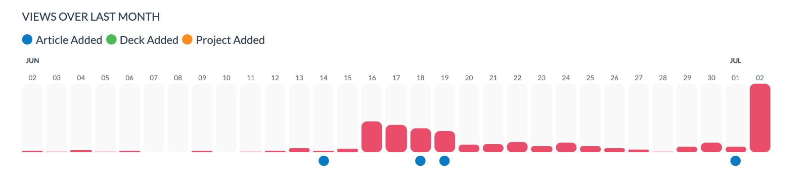
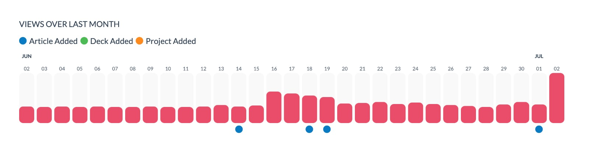

Yesterday [I posted to /r/reactjs](https://www.reddit.com/r/reactjs/comments/hjxblx/just_finished_implementing_the_darkmode_toggle_on/) for the first time and it was an awesome learning experience. I saw a **2000% increase in traffic**. Suddenly I had an army of users navigating around my site, commenting on the design and content. And, while it was on the whole a positive expereience, it also caused a few unforseen issues on my website that I wanted to talk about. I'm hoping that by showing you how I solved some of them you can avoid running into similair issues when you see a spike of your own.

### Identified Issues

#### Highlighting A Feature

Like many other intractable on my site, I have an event set up to track when the dark-mode toggle is used. By tracking it, I can be sure that there is enough engagement with it to justify it being there. 

In my post I highlighted the dark-mode feature on my website. What this meant was that every user who landed on my site was going to interact with the feature - nearly 8000 times. As a result I have to ignore the data associated with this feature for the last couple of days as user behaviour was "forced". At least we know it works. `Don't highlight features that you want to test through natural user interaction.`

#### A Skewed Stats Page

I was seeing an average of a hundred views a day before the reddit post and, on the day I posted, this shot up to thousands. This made the graph that shows daily views on my stats page look like this:

Suddenly it looked like some days had recieved no views as they paled into insignificance compared to the last day. This is because I had made no attempt to normalise the data. 

I needed a quick solution. After some googling, I came across [this stack overflow post](https://stackoverflow.com/questions/14098895/math-i-need-to-normalize-some-bar-graphs/14116402#14116402) on normalising bar graph data. Calculating a weighted average using `A' = (1-α)*A + α*B` made my graph look soo much better:

#### Firebase Usage Quotas

For years I have been using firebase projects and never got close to quota limits, yet yesterday I managed to hit the limit for hosting. This was annoying because I had not given google my credit card, which meant that they just decided to stop serving up my assets without notifying me. This site is now costing me more money, thanks reddit! 

But the larger issue here is that `my bundle size is too big`. If it was smaller then I could have more users visiting without hitting the paywall. The problem is, with less javascript, there will be less "shine". I've started identifying big libraries that need to go using [`gatsby-plugin-webpack-bundle-analyzer`](https://www.gatsbyjs.org/packages/gatsby-plugin-webpack-bundle-analyzer/). That combined with some image optimization should help bring down that beefy bundle size.

#### Social Media Links

One of the comments on reddit was from [swzx](https://twitter.com/swyx):

> I'd love to promote you on twitter but i couldnt find any account. if you're interested in making a twitter account i'd love to help you share your work.

This is a huge issue. Someone found my site, wanted to promote me but couldn't find [my twitter handle](https://twitter.com/SamLarsenDisney). `Make your social links easy to find.` I nearly lost an awesome oppurtunity to get noticed by a larger audience. 

### The Good

While there were plenty of issues, putting myself out there also showed me there is a lot working on this website. 

#### Article Reactions Validated

[I recently added article reactions](/articles/Creating-Page-Reactions) and as a new feature it was super awesome to see that they were being utilised. It seems that new visitors paticularly liked 🥑's - millenials maybe? Lets test this - If you're a millenial and reading this do me a favour and hit the avacado reaction.

#### People Really Like Stats

[My stats page](/stats) recieved an immense amount of positive feedback. I've been encouraged to work on it more - I have some great stats in mind so watch this space. Thanks for keeping me motivated!

#### My Socket Server

I use a socket server to track the number of simultaneous visitors to the site. It's set up on the hobby teir of Heroku. I was pleseantly surprised that the increased traffic didnt have any effect on the server. Load didnt increase and I saw no errors.

I did a little more research and it seems I could have handled around 4000 simultaneous before seeing any issues - man thats cool.

#### Sentry.io

My javascript code did break for a few people. `I managed to catch what these errors were using sentry.io`. Don't know what it is? [Read this](/articles/How-Sentry.io-Helped-Me-Fail-Fast). Its easy to add to any kind of react project and will really help you out in the long run - did I mention its free?

By seeing where in the code errors were happening on client machines, I was able to fix them as edge cases were discovered. Most errors were only seen by one user before being fixed - I call that a win.

### That's all Folks
Yes the site had issues being exposed to soo many people but I never would have known had I not shared it. `I would encourage anyone working on a personal site or any other open source project to put yourself out there so you too can get some awesome feedback from real people!` Looks like I've got homework.