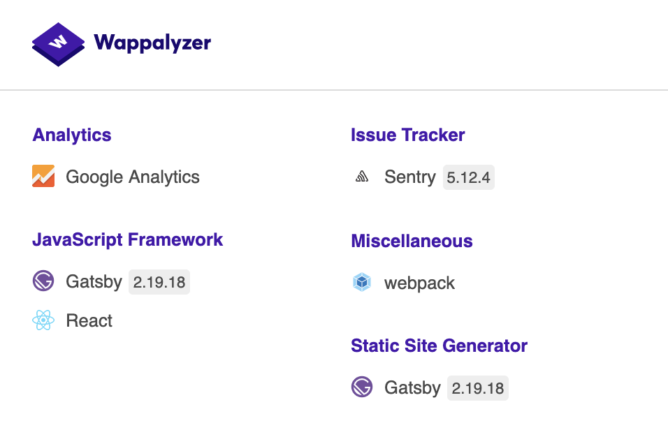
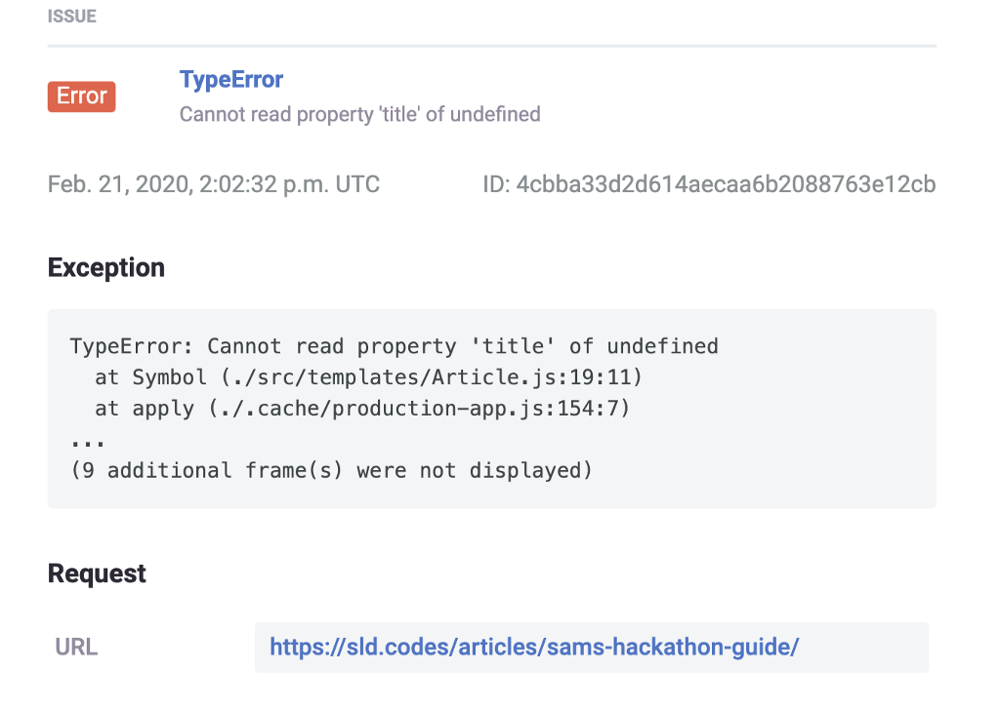

I ❤ sentry.io

I’ve fallen in love with an extension called “[Wappalyzer](https://www.wappalyzer.com/)”. It allows you to identify the technologies being used on any given website. Navigating to any site and clicking the extension gives you something likes this:

During my research [auditing the first 100 pages of the top 100 websites](https://medium.com/@samlarsendisney/auditing-the-first-100-pages-of-the-top-100-websites-2e30c4d36847), I used this extension to identify if tech stack had any influence on a site’s scores. All the sites I admired had one thing in common. The issue tracker they were using was [sentry.io](https://sentry.io/).

#### Whats Sentry.io?

> Cloud-based error monitoring that helps all software teams discover, triage, and prioritise errors in real-time.

By placing a small script in my html, sentry will track when my code breaks for users. It will tell me exactly where in my code the bug occurred, on what device, and will even make a guess as to what commit caused the bug. Crazy cool.

After visiting the site, and realising that all I needed was the free tier, I immediately added the script. Then I forgot about it.

#### Failing Fast

I recently made the transition from writing my blog posts in Markdown on my personal site to writing them on Medium and using an rss feed to add them to [my personal site](https://sld.codes/). When I made this transition, I decided that I would still keep my legacy posts as there were some that we’re still seeing a lot of traffic (e.g. [Sam’s Hackathon Survival Guide](https://sld.codes/articles/sams-hackathon-guide)).

In order to query data from both markdown, and the rss feed, I had to update the graphQL query for the articles page. When I modified this query, I managed to forget to include one vital piece of information, the page slug 😭. By doing so, anyone navigating to my legacy articles, was greeted with a white screen of death as the page’s data was undefined.

Luckily, the first time this happened, I received an email from sentry:

I immediately understood what I had done wrong, and had a fix live within 5 mins. This meant that this bad user experience was only felt by one user. Pretty good damage control if you ask me.

❤