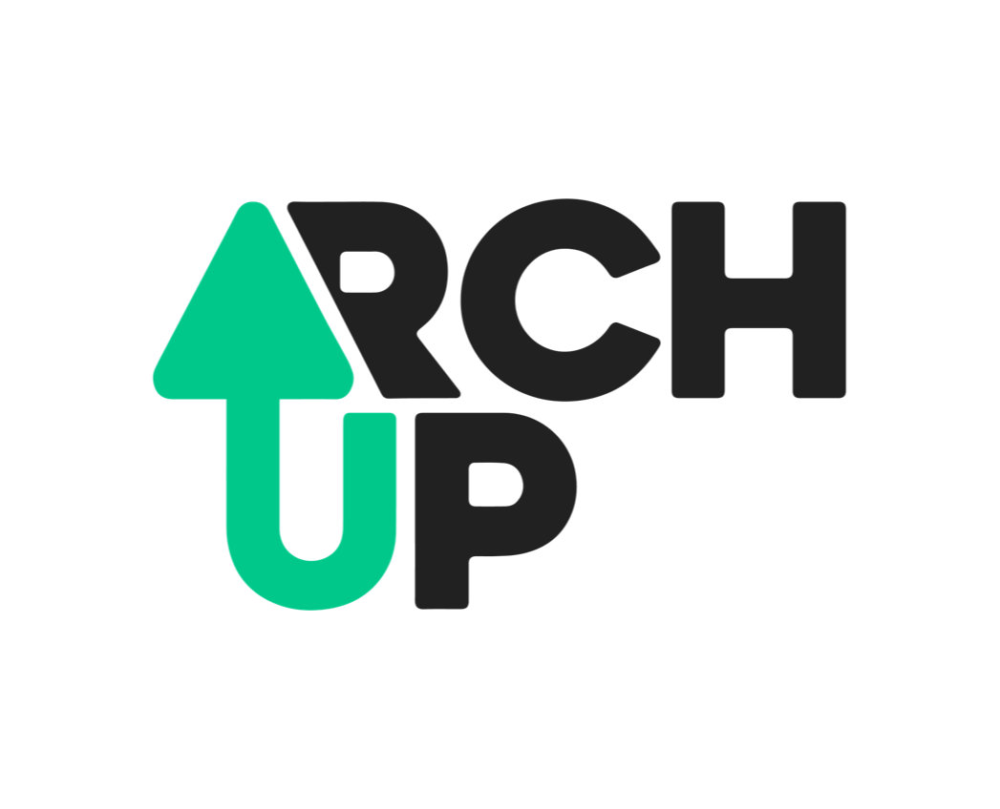
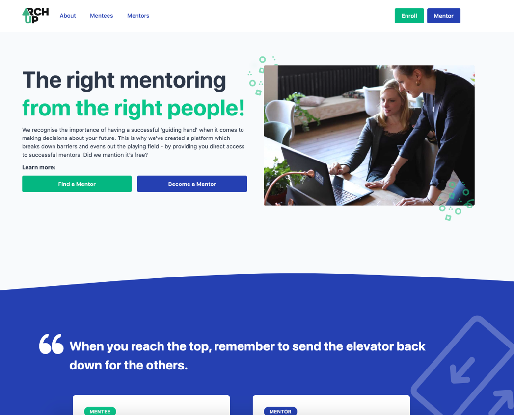
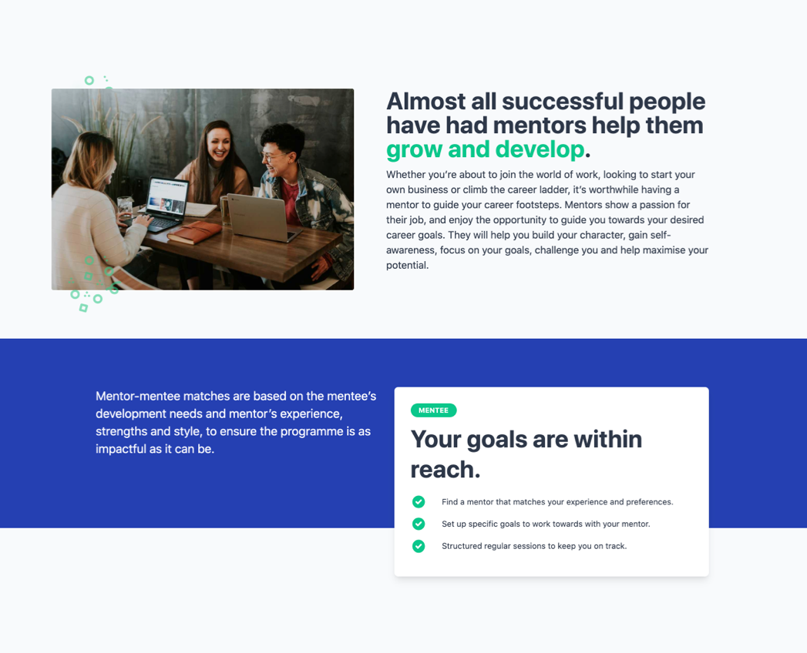

  

    <h4>Performance Overhaul</h4>
    

      When appealing to a younger generation, it is super important that your
      site behaves as fast as other platforms. During this project I was able to
      improve the load time of the site from 6 seconds down to 0.6 seconds.
    

  

  

    
  

  

    
  

  

    <h4>Redesign</h4>
    

      Refreshed the site to appeal to a younger audience whilst also improving the accessiblity to bring it in line with WCAG AAA.
    

  

  

    <h4>Mentoring Done Better</h4>
    

      Since the launch, the site has had zero down-time and has seen a significant traffic increase.
    

  

  

    
  

  

    

    <h2 class="pad-3-b">Visit The Site</h2>
    <a href="https://archup.co.uk/">
      <button class="btn-accent">Take Me There</button>
    </a>
  

