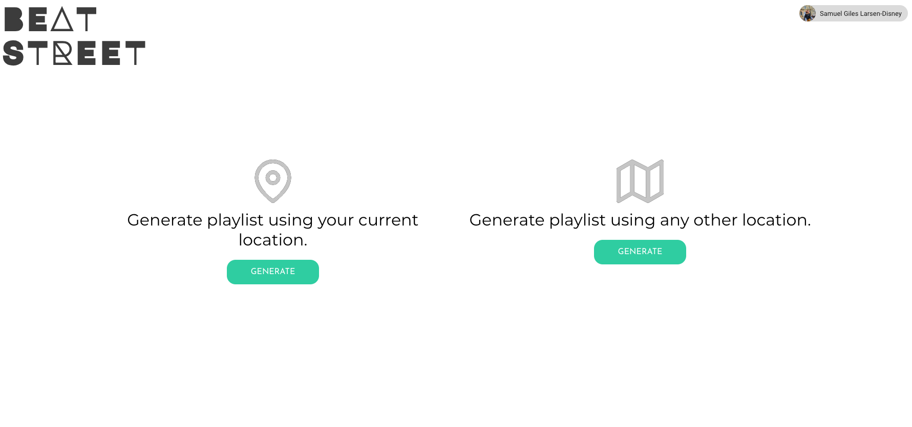
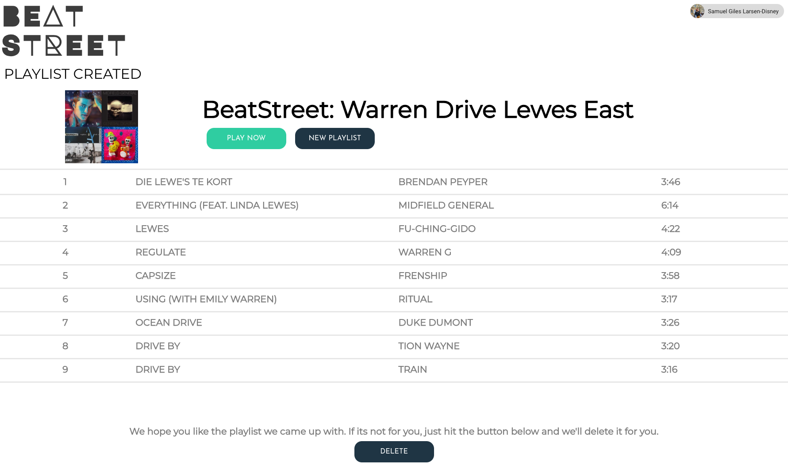

    

        <h4>A New Way To Find Music</h4>
        

    

    

         
    

    

        
    

    

        <h4>Beats From Near You Or Far Away</h4>
        

    

    

        <h4>Auto Generated Playlists</h4>
        

    

    

        
    

