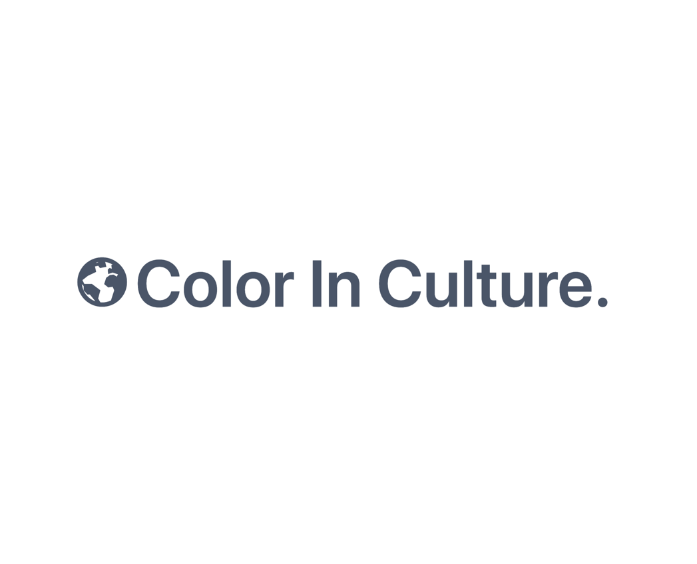
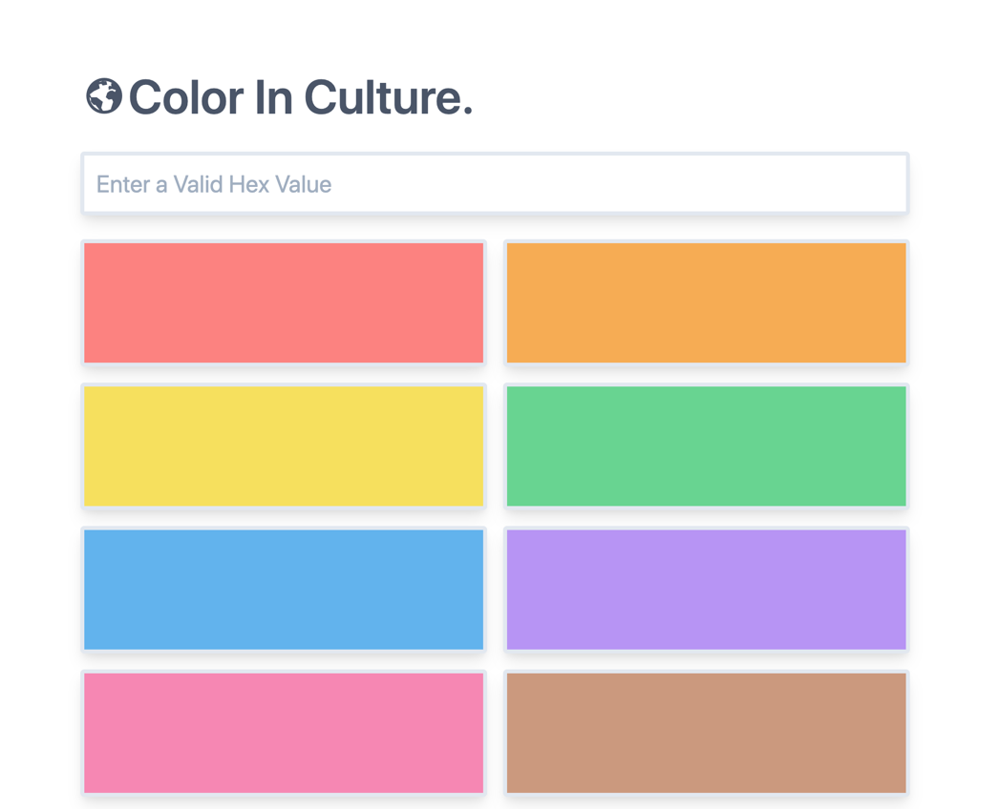
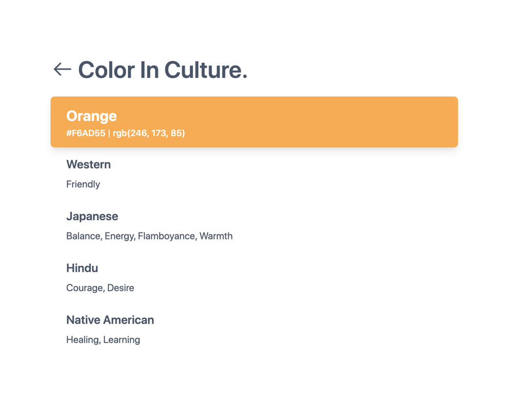

    

        <h4>Colors Are Subjective</h4>
        
We often think about colors as being "global" but did you know that how you feel about color can also be affected by your culture? 

        
    

    

         
    

    

        
    

    

         <h4>Find The Culture Associations Of Any Color</h4>
        
Simply type in a  hex code and get surprised by the contrasting meanings of that color in many cultures.

    

    

        <h4>Many Cultures</h4>
        
The site features cultures including: Western, Japanese, Hindu, Native American, Chinese, Asian, Eastern European, Muslim, African and South American

    

    

        
    

    

         

        <h2 class="pad-3-b">Visit The Site</h2>
        <a href="https://colorinculture.app/"><button class="btn-accent">Take Me There</button></a>
    

    

