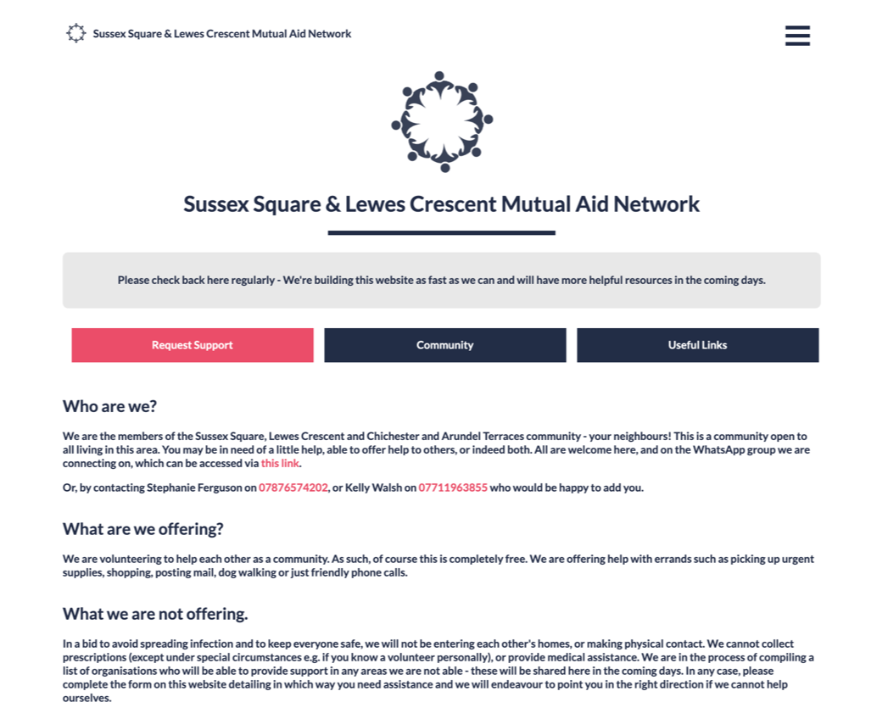
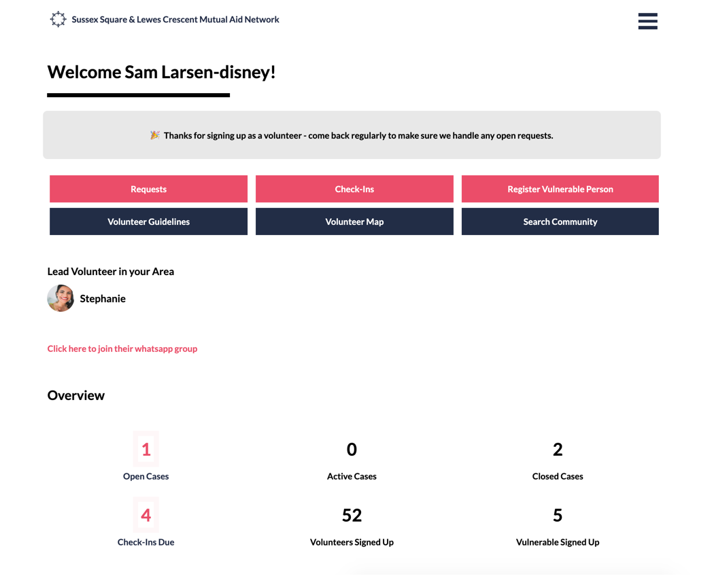
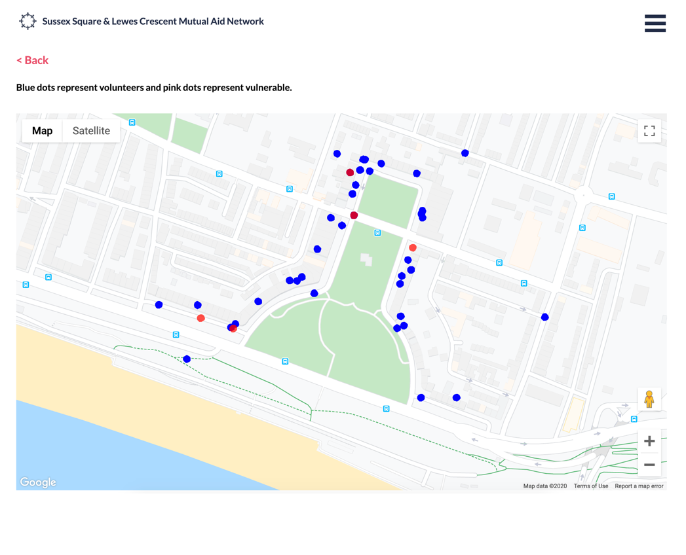

    

        <h4>A Digital Community</h4>
        

    

    

        
    

    

        
    

    

        <h4>Volunteer Dashboard</h4>
        

    

    

        <h4>Pinpointing Requests</h4>
        

    

    

        
    

<blockquote style="font-weight:normal; font-size:1.1em">
I’m normally a bit of a perfectionist but this time speed was most important. I needed to get a version of the site deployed as gast as possible so that it could start helping those in need. </blockquote>

 
I have also written an article describing some of the thought proccess I went through when building this platform. Check it out!

<a href="/articles/Using-GatsbyJS-to-Help-My-Mutual-Aid-Network"><button class="bubble-button border-radius">Read the article</button></a>

