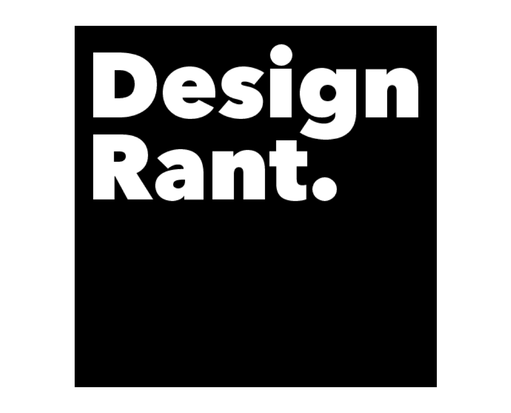

    

        <h4>Sometimes You Need To Complain</h4>
        
When browsing the web, I often come across things that don't work, accessibility issues and design flaws. If its once off, I try and ignore it. But often its the case that these issues don't get fixed and I wanted to create a place to write about them. 

    

    

         
    

    

        
    

    

        <h4>Minimal Design</h4>
        
It was important that a site dedicated to short sharp comments had a minmal design. This is so that the focus is on what matters - the complaints!

    

    

        <h4>Lightening Fast Site Search</h4>
        
The site features an elastic-lunr search index so finding that article you read is super easy and more importantly - super fast!

    

    

        
    

    

         

        <h2 class="pad-3-b">Visit The Site</h2>
        <a href="https://designrant.app/"><button class="btn-accent">Take Me There</button></a>
    

    

