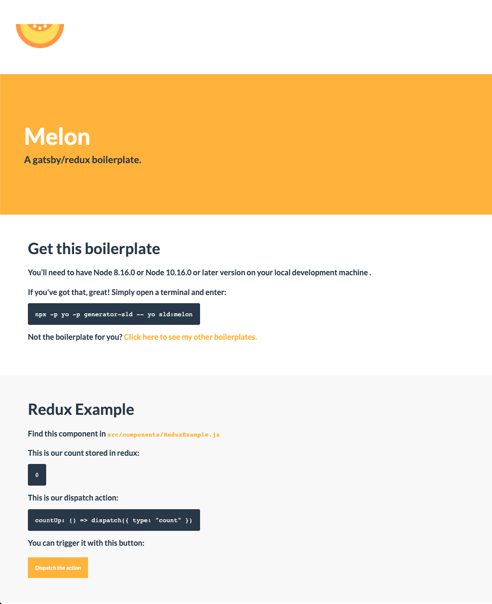
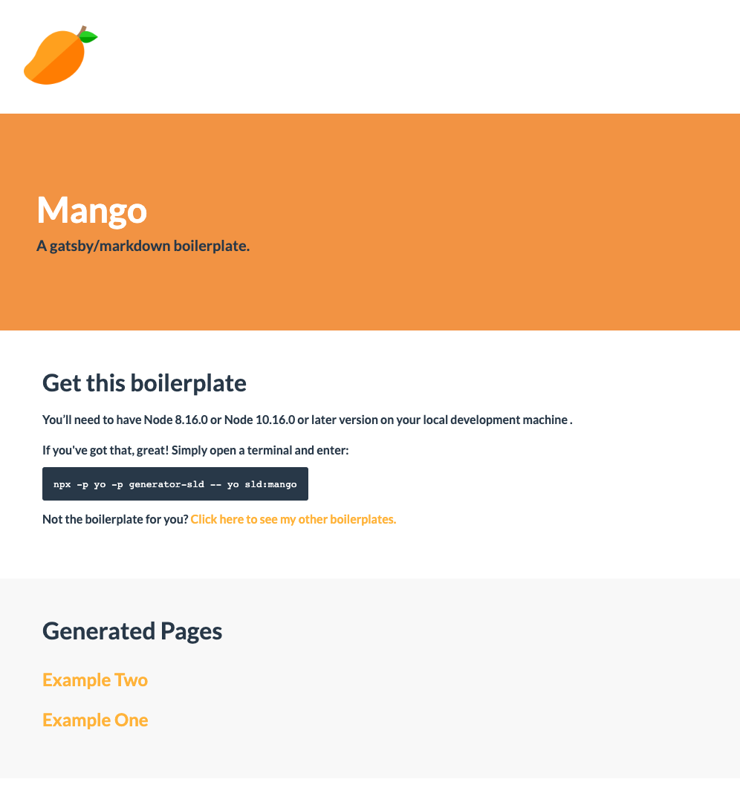

<a href="/boilerplates"><button class="bubble-button border-radius">Start using these boilerplates</button></a>

## The Idea
I built a series of boilerplates for GatsbyJS as it's awesome but can be hard to configure if you are new to coding. I wanted to make it accessible to people who are at hackathons and just want to start quick!

## Quickstart
I created a yeoman generator that would allow you to clone, install and have you ready to rock (🎸) in these boilerplates with a single terminal command:

`npx -p yo -p generator-sld -- yo sld`

By default, all these boilerplates come with scss styling for grid layout, colour maps, margins, padding and more!

    

         <h3 class="margin-0">Gatsby Melon</h3>
    

    

        
    

    

         <h3 class="margin-0">Gatsby Mango</h3>
    

    

        
    

