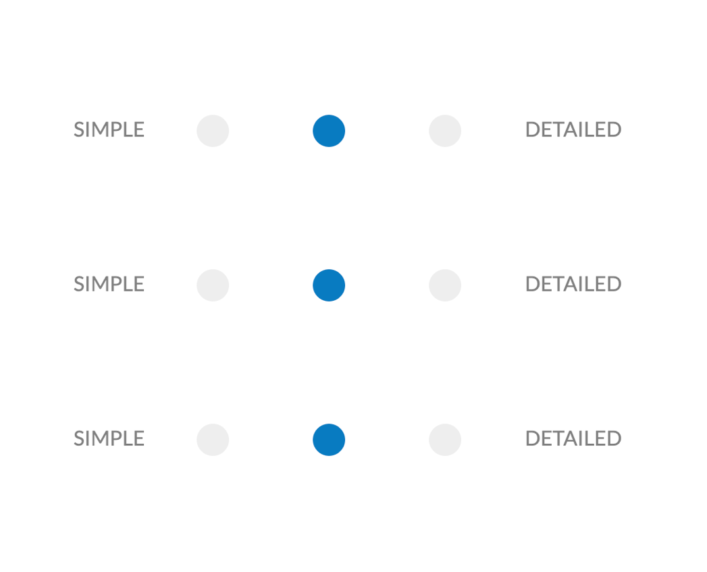
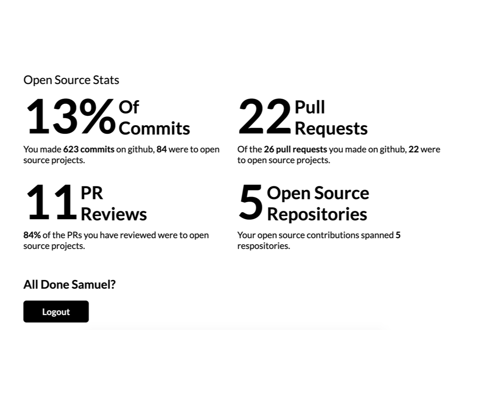

    

        <h4>A One Day Build</h4>
        
I wanted a way to measure my open source contributions. This site does it in 20 seconds or less using the Github graphQL API!

    

    

         
    

    

        
    

    

        <h4>Level of Detail</h4>
        
Once logged in, the site creates three views in which you can get your results. These are shown in increasing levels of detail simple, medium and detailed.

    

    

        <h4>The Stats You're After.</h4>
        
Instead of hiding these stats away in your contributions on github, this bubbles them to the top so you can retrieve the numbers you're after in a single click.

    

    

        
    

        
        <h2>Visit The Site</h2>
        <a href="https://opensourceand.me/"><button class="btn-accent">Take Me There</button></a>

    

